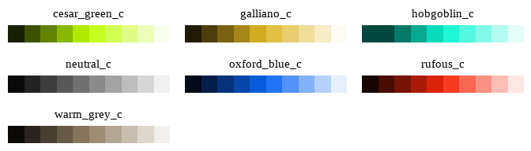
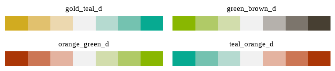

<!-- README.md is generated from README.Rmd. Please edit that file -->

# seizer 

The **seizer** package is designed to make data visualisation quick,
easy and consistent for all Cesar staff. The package contains a few
functions which fit in the general `ggplot2` syntax, and by using them
you can make sure your figures will always look the same and adhere to
the Cesar Australia style guide.

## Installation

**seizer** can be installed by running the following code:

``` r
# install package from GitHub
require(devtools)
devtools::install_github("cesaraustralia/seizer")
```

You may be asked to update some packages, if the existing versions
installed on your computer are old. Updating may cause compatibility
issues with old code, so I suggest skipping updates on the first install
attempt. If the package works fine, then there’s nothing to worry about.

## Using seizer

**seizer** is built to work neatly with `ggplot2`. If you are familiar
with `ggplot2` syntax, using this package will be very simple. The idea
is you build your figures as you usually would in `ggplot2`. Then, you
can use the supplied functions in **seizer** to transform your figures
into a consistent theme.

Here is a `ggplot2` figure, which includes pretty much everything you
might include in a figure: aesthetics, mappings, titles, subtitles,
legends, facets, etc. This plot is rendered with the default `ggplot2`
settings:

``` r
p <- iris %>%
  ggplot(aes(x = Sepal.Length, y = Petal.Length, colour = Sepal.Width, fill = Species)) + geom_point() + geom_smooth() + facet_wrap(~Species, scales = "free") + labs(title = "This is a title", subtitle = "This is a subtitle")

p
#> `geom_smooth()` using method = 'loess' and formula = 'y ~ x'
```

<!-- -->

Now, you just add the `theme_cesar()` function to transform your plot,
using theme elements designed to fit with data visualisation principles
and the Cesar Australia style guide:

``` r
p <-
  p + theme_cesar()

p
#> `geom_smooth()` using method = 'loess' and formula = 'y ~ x'
```

<!-- -->

Notice that while the “static” plot elements have changes (colours,
linewidths and fonts of labels, gridlines, backgrounds, etc.), the
colours that are actually mapped onto the data using the `aes()`
function have remained unchanged at their default values. You might
recall that in order to change these in the `ggplot2` syntax you need to
use the `scale_` family of functions. **seizer** comes with its own
family of `scale_cesar` functions, which allow you to map Cesar
Australia colour palettes onto your figures:

``` r
p <-
  iris %>% ggplot(aes(x = Sepal.Length, y = Petal.Length, colour = Sepal.Width, fill = Species)) + geom_point() + geom_smooth(colour = ancient_lavastone) + facet_wrap(~Species, scales = "free") + labs(title = "This is a title", subtitle = "This is a subtitle") +
  theme_cesar() + scale_colour_cesar_c(palette = "galliano_c") + scale_fill_cesar_d()

p
#> `geom_smooth()` using method = 'loess' and formula = 'y ~ x'
```

<!-- -->

The next section contains more information about these colour palettes
and how to use them.

The final function you will use is `cesar_save()`. This is a wrapper
function around the `ggsave()` function which you may have come across,
but uses several pre-determined presets to generate your outputs. These
match the size and resolution of the saved plot to the destination
format. There are five presets: `twitter`, `web`, `linkedin`, `facebook`
and `print`. If no preset is specified, the function defaults to
`print`. There is also an optional argument, `logo`, which can be used
to add a Cesar logo at the top right of the plot by setting
`logo = TRUE`. This is turned off by default. You can also specify a
destination pathway using the `path` argument - by default, the plot is
saved to your working directory. Finally, the export defaults to .png
format if an accepted format is not specified in the filename (e.g.,
“plot.jpeg”).

For example, if we wanted to save our plot in a web format (72dpi) with
a logo, we would run the following code:

``` r
cesar_save(filename = "cesar_web.png", preset = "web", logo = T)
```

This automatically exports the last rendered plot into the working
directory with the selected presets.

## Cesar Australia colour palettes

Finally, **seizer** contains a variety of colour palettes which can be
used for your data vis. These are derived from the colours in the Cesar
Australia style guide, with slight modifications to hue or brightness
values to make them more suitable for data visualisation. As explained
above, these can be easily plugged into `ggplot2` objects using the
`scale_cesar` family of functions. However, you can also access the
palettes directly using `cesar_palettes` to see the available palettes
or pull individual colours or palettes out - for instance if you want to
use them for a base R figure.

### Discrete palettes

**seizer** includes two discrete palettes, which are suitable for
mapping onto unordered categorical variables:

<!-- -->

These include 7 colours - if you have more groups in your data, colours
will be recycled. An alternative option is to discretise a continuous
colour scale (either sequential or diverging) by passing it to a helpter
function (see below) - this may be useful for ordered categorical
variables, but note that colours may end up being too similar to discern
between groups.

### Sequential palettes

**seizer** includes seven sequential palettes, which are suitable for
mapping onto continuous variables. These are all based on “primary”
cesar colours, and vary in brightness values around a single base hue.
The seven palettes are:

<!-- -->

### Diverging palettes

**seizer** includes four diverging palettes, which are suitable for
mapping onto continuous variables. These are especially useful for
visualising data that have a distinct, meaningful midpoint - for
example, negative vs. positive values, which are centered around zero.
Alternatively, any biologically meaningful midpoint which needs to be
emphasised. The four palettes are:

<!-- -->

Please note that for diverging palettes especially, care should be given
to use palettes that are colour blind friendly. While all of these
palettes are discernible to people with either protanopia or
deuteranopia-type colour blindness, `gold_teal_d` and `teal_orange_d`
may be the best ones to use.

### Helper functions

A helper function is included with **seizer** to generate colour
palettes of a user-defined length. This is `cesar_rampr()`, which
accepts as arguments a number of colours requested, a colour palette
(use `names(cesar_palettes)` to view all available palettes), an alpha
value for transparency, and a logical argument to reverse the palette,
if requested. It then generates a vector of colours, which can be used
manually in plotting. If a discrete palette is selected, the function
simply returns the colours in the palette in the same order, recycling
colours if n \> 7. If a continuous palette is selected, the function
performs linear interpolation to discretise the palette and return
several discrete values of length n.

``` r
new_pal <- cesar_rampr(n = 15, pal_name = "oxford_blue_c", alpha = .7)

new_pal2 <- cesar_rampr(n = 4, pal_name = "cesar_light", reverse = T)

plot(as_palette(list(new_pal, new_pal2)))
```

<!-- -->

Finally, two additional helper functions are includes, `cesar_pal()` and
`cesar_gradient_n_pal()`. These are a bit more complicated, and serve as
wrappers around `cesar_rampr()` to facilitate its use in `scale_cesar`
functions. In other words - you can safely ignore these, but feel free
to play around with them if you’d like.
